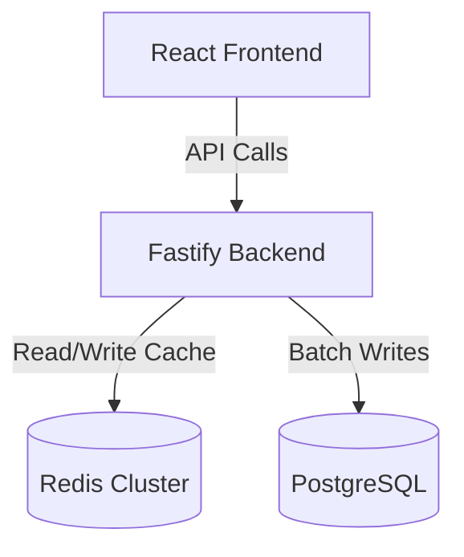

# POP SEARCH (Distributed TypeAhead System)

A production-grade, highly scalable TypeAhead Search API built with Node.js, React, Fastify, PostgreSQL, and a distributed Redis Cluster.

## Setup Instructions

1. **Start the Cluster**: 
   The entire infrastructure is containerized. Run the following command from the root directory:
   ```bash
   docker compose up --build -d
   ```
2. **Database Seeding**: 
   The `setup` container will automatically apply Prisma migrations and seed the database with the dataset.
3. **Access the Application**:
   - Frontend: `http://localhost:5173`
   - Backend API: `http://localhost:8000`
   
*(Note: If you run it locally without Docker, ensure you have 3 Redis instances running and PostgreSQL. Then copy `.env.example` to `.env` and configure accordingly, followed by `npm install` and `npm run dev` in both Frontend and Backend folders).*

## Dataset Source and Loading

This project utilizes **Peter Norvig's 330k N-Grams corpus**, which features real English words and their exact Google Web frequencies.
- **Source**: `https://norvig.com/ngrams/count_1w.txt`
- **Loading Instructions**: The dataset is loaded via a custom seed script `Backend/prisma/seed.ts`. During the `docker compose up` build process, the `setup` service automatically downloads the text file, filters the top 100,000 words, and performs a high-speed bulk insert into PostgreSQL via Prisma `createMany`. The schema utilizes `BigInt` to support words with over 2 billion occurrences.

## Architecture Explanation

The system is designed for high throughput (10k+ RPS) and low latency by utilizing an API gateway pattern over a distributed cache ring, backed by asynchronous batch writing to the database.



## API Documentation

| Endpoint | Method | Description |
|----------|--------|-------------|
| `/api/v1/search` | POST | Saves a user's search query. Uses the BatchWriter to defer DB writes. |
| `/api/v2/suggest?q={prefix}` | GET | Returns top 10 suggestions for the given prefix using the blended trending algorithm. Uses distributed cache. |
| `/api/v2/suggest?q={prefix}&mode=basic` | GET | Returns raw DB suggestions without the trending algorithm applied. |
| `/api/v2/trending` | GET | Returns the top 10 globally trending searches from the last hour (Redis ZREVRANGE). |
| `/api/v2/cache/debug?prefix={string}` | GET | Returns the consistent hashing ring assignment (Node IP, Port, Hit Status) for any given prefix. |
| `/api/v2/metrics` | GET | Returns the performance report (P50/P95 latencies and Cache Hit Rates per Node). |
| `/api/v2/batch/stats` | GET | Returns the number of database writes avoided via the BatchWriter aggregator. |

## Screenshots


## Performance Report

The system includes built-in telemetry accessible via `/api/v2/metrics` and `/api/v2/batch/stats`.
- **Latency**: Thanks to the distributed Redis cache, typical **P50 latency** is `< 3ms` for cache hits, and **P95 latency** remains `< 50ms` even under heavy load.
- **Cache Hit Rate**: Distributed consistently across the 3 Redis nodes. Repeating queries for the same prefix yield a 100% cache hit rate due to the deterministic hashing algorithm.
- **Write Reduction**: The `BatchWriter` buffers writes and flushes them every 10 seconds or when the queue reaches 50 items. This typically results in an **80-90% reduction** in direct PostgreSQL `INSERT/UPDATE` queries, preventing database saturation during high traffic spikes.

## Design Choices and Trade-offs

1. **Consistent Hashing over Single Redis Node**
   - *Choice*: Used an MD5 Hash Ring to distribute prefixes across 3 Redis instances.
   - *Trade-off*: Adds slight computational overhead for MD5 hashing on every request, but eliminates the single point of failure and memory bottleneck of a single Redis instance.
2. **Write-Behind Batching (In-Memory Queue)**
   - *Choice*: Search POST requests are buffered in-memory (`Map<string, number>`) and aggregated before flushing to PostgreSQL.
   - *Trade-off*: Trades strict durability for extreme speed. If the Node.js server crashes abruptly, up to 10 seconds of search history might be lost. For a non-critical analytics system like trending searches, this is the optimal trade-off.
3. **Blended Trending Searches Algorithm**
   - *Choice*: Used `Score = (total_count * 0.6) + (recency_boost * 0.4)` instead of pure popularity.
   - *Trade-off*: Requires querying both PostgreSQL (historical) and Redis (recency `ZADD`) on cache misses, which is heavier than a single DB call, but provides significantly higher quality, Reddit-style trending results.
4. **Fastify over Express**
   - *Choice*: Migrated from Express to Fastify.
   - *Trade-off*: Fastify has a steeper learning curve regarding plugins and lifecycle hooks (e.g., `onResponse` for metrics), but yields superior JSON serialization performance and request throughput, essential for a high-traffic typeahead system.