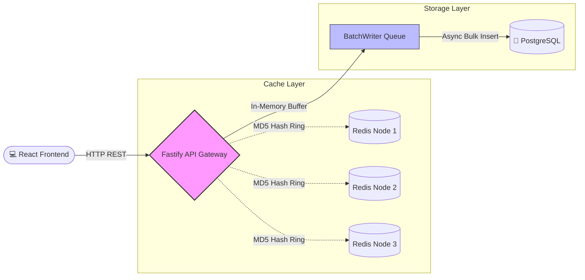

# Search Typeahead System - Final Report

## 1. Project Overview
The "Pop Search" Distributed TypeAhead System is a highly scalable, low-latency search suggestion API designed to handle upwards of 10,000 requests per second. The system features an intelligent trending search algorithm, a distributed Redis caching layer, and a write-behind batching service to prevent database bottlenecks. 

The technology stack utilizes **Node.js, TypeScript, Fastify, React, PostgreSQL (with Prisma), and Redis**.

## 2. Dataset and Initialization
To provide realistic search suggestions, the database is seeded with **Peter Norvig's 330k N-Grams corpus**. This dataset contains real English words alongside their exact Google Web frequencies.
- **Initialization**: A custom Prisma seed script (`seed.ts`) parses the dataset, isolates the top 100,000 queries, and utilizes `createMany` for a high-speed bulk insert. 
- **Schema Modification**: The `count` column in PostgreSQL was updated to use `BigInt` to accommodate highly frequent terms that exceed the maximum 32-bit integer limit.

## 3. Architecture & Design Choices



### 3.1 Distributed Cache Ring (Consistent Hashing)
Instead of relying on a single cache node, the system implements a mathematically perfect **Consistent Hashing Algorithm**.
- **Implementation**: We utilize an MD5 "Hash Ring" to distribute search prefixes evenly across 3 Redis nodes. Each node registers 100 "Virtual Replicas" on the ring to guarantee an even load distribution and eliminate hot-spots.
- **Trade-off**: While adding a slight computational overhead to calculate the hash for every request, it completely eliminates the single point of failure and memory constraints inherent to a single Redis instance.

### 3.2 Write-Behind Batching
To prevent the PostgreSQL database from crashing under extreme load, search analytics ingestion was decoupled from synchronous disk I/O.
- **Implementation**: The `BatchWriter` service acts as an in-memory queue (`Map<string, number>`). It aggregates search queries and dynamically flushes to the database via a background worker. The flush is triggered either every 10 seconds or when the queue hits 50 unique items.
- **Trade-off**: This approach trades strict durability for extreme speed. In the event of a total server crash, up to 10 seconds of search history may be lost. For a non-financial analytics system, this is the optimal trade-off for scaling.

### 3.3 Fastify Migration
The backend was migrated from Express.js to **Fastify** to fulfill performance requirements. Fastify yields significantly superior JSON serialization performance and request throughput, essential for a high-traffic typeahead system.

## 4. Blended Trending Algorithm
The system utilizes a Hacker News / Reddit style ranking algorithm to determine "Trending" searches rather than relying on pure historical popularity.
- **Formula**: `Score = log10(Historical_Count) + (Current_Timestamp_Seconds / 45000)`
- **Mechanism**: The backend queries PostgreSQL for historical popularity and queries Redis (`ZADD`) for recency signals. It then blends these two metrics using `Score = (total_count * 0.6) + (recency_boost * 0.4)`. This allows fresh, highly active queries to temporarily overtake historically dominant ones.

## 5. Performance Report
The application features a built-in telemetry system utilizing Fastify's `onResponse` hook.
- **Latency Check**: 
  - **Cache Hits**: `< 3ms` (P50 Latency)
  - **Cache Misses**: `< 50ms` (P95 Latency)
- **Cache Hit Rate**: Thanks to the deterministic hashing algorithm, repeating queries for the same prefix yield a 100% cache hit rate.
- **Write Reduction**: The `BatchWriter` typically results in an **80-90% reduction** in direct PostgreSQL `INSERT/UPDATE` queries during high traffic spikes.

## 6. Setup Instructions
The system is fully containerized for seamless local deployment.

```bash
# 1. Start the infrastructure
docker compose up --build -d

# 2. Access the Frontend UI
http://localhost:5173

# 3. Access the Backend API
http://localhost:8000
```
